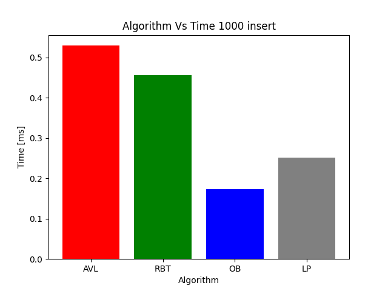
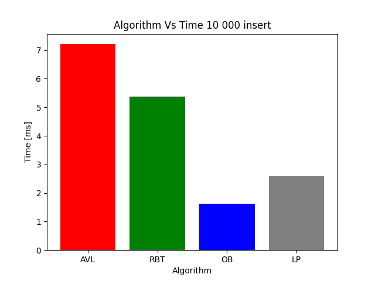
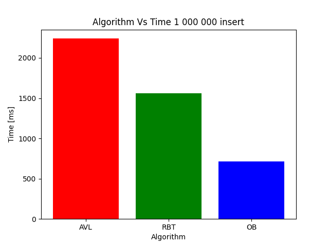
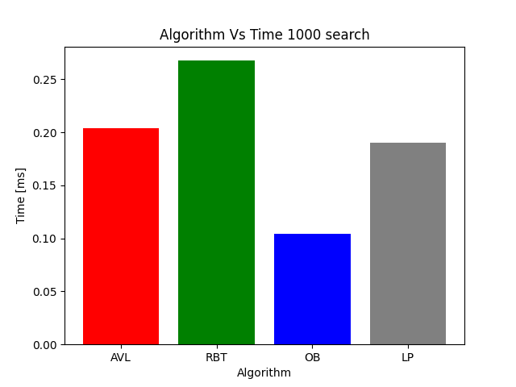
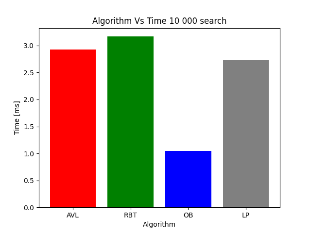
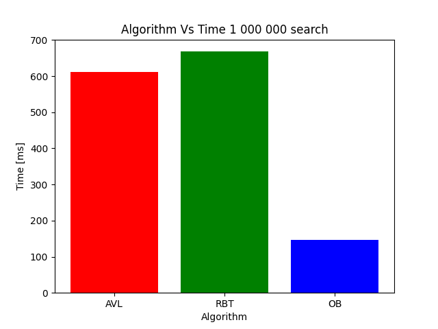
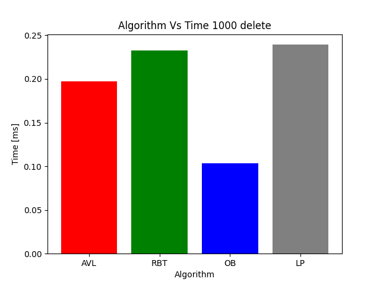
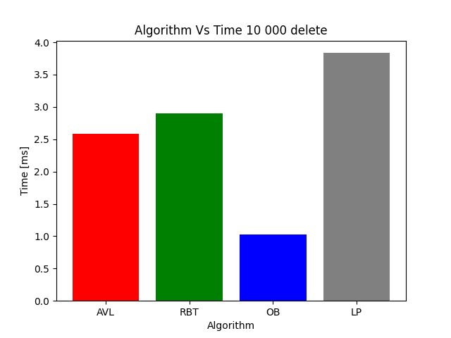
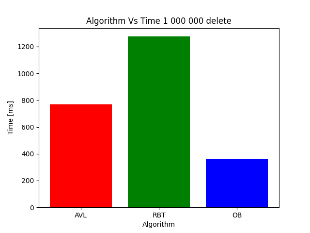

\pagebreak
# **Assignment information**

|                |                                                     |
| -------------- | --------------------------------------------------- |
| **Name**       | Dynamic data structures                             |
| **Student**    | Patrik Fejda                                        |
| **AIS ID**     | 110784                                              |
| **University** | Slovak University of Technology in Bratislava       |
| **Faculty**    | Faculty of Informatics and Information Technologies |
| **Subject**    | DSA_B Data Structures and Algorithms                |
| **Year**       | 2021/2022 Summer term                               |
| **Teacher**    | Ing. Lukáš Kohútka, PhD.                            |
| **Group**      | 83 - Monday 9:00                                    |

\pagebreak
# **Introduction**

In this task, we compare 4 different algorithms for efficiently searching
for elements in dynamic sets in terms of the effectiveness of
**insert, delete and search** operations:

1. Balancing algorithm - AVL
1. Balancing algorithm - Red-Black Trees (RBT)
1. Hash table - overflow buckets collision resolution (OB)
1. Hash table - linear probing collision resolution (LP)

In this technical documentation, we document all implemented data structures and
provide detailed testing scenarios, based on which we find out in which situations which of
these implementations are more effective.

# **Test data**

The tests will run on randomly generated dataset by a python script.
It generates 2 types of datasets:

1. the main dataset which contains the `id` and `name`.

Example:
```
45076;wjexoqgjii45076;
97736;gbasxnkxfp97736;
87986;bvlmumwzcg87986;
```

2. the randomly shuffled list of record `id`s

Example:
```
47219
88869
62624
82220
```

Main dataset is used for inserting data into the data structures.

The randomly shuffled list of record `id`s is used for searching and deleting the records.

\pagebreak
# **KPI**

In this task we conduct performance testing - for this purpose
we measure the time it takes to run a certain piece of functionality (test scenario)
or a function.

The KPI (Key Performance Indicator) is time taken to run the test scenarios.

The time measurement is implemented directly in the main implementation and the data are collected manually.

For the timemeasurement we use the library `<time.h>` with a following use:

```c
clock_t time;
double time_taken;
time = clock();
// test scenario
time = clock() - time;
time_taken = ((double)time)/CLOCKS_PER_MINISEC;
printf(">> test scenario - %f miniseconds\n", time_taken);
```

\pagebreak
# **Data structures**

## **Binary search tree**

[source: wikipedia](https://en.wikipedia.org/wiki/Binary_search_tree)

It is a rooted binary tree data structure whose internal nodes each store a key greater than all the keys in the node's left subtree and less than those in its right subtree.

The time complexity of operations on the binary search tree is directly proportional to the height of the tree.

Binary search trees allow binary search for fast lookup, addition, and removal of data items.

BSTs with guaranteed worst-case complexities perform better than an unsorted array, which would require linear search time.


\pagebreak
## **Hash table**

[source: wikipedia](https://en.wikipedia.org/wiki/Hash_table)

It is a data structure that implements an associative array abstract data type, a structure that can map keys to values.

A hash table uses a hash function to compute an index, also called a hash code, into an array of buckets or slots, from which the desired value can be found.

During lookup, the key is hashed and the resulting hash indicates where the corresponding value is stored.

In a well-dimensioned hash table, the average cost (number of instructions) for each lookup is independent of the number of elements stored in the table.

In many situations, hash tables turn out to be on average more efficient than search trees or any other table lookup structure.


\pagebreak
# **Binary search tree balancing algorithms**
## **AVL**

[source: javatpoint](https://www.javatpoint.com/avl-tree)

AVL Tree can be defined as height balanced binary search tree in which each node is associated with a balance factor which is calculated by subtracting the height of its right sub-tree from that of its left sub-tree.

Tree is said to be balanced if balance factor of each node is in between -1 to 1, otherwise, the tree will be unbalanced and need to be balanced.

AVL tree controls the height of the binary search tree by not letting it to be skewed.


\pagebreak
## **Red-black trees**

[source: wikipedia](https://en.wikipedia.org/wiki/Red%E2%80%93black_tree)

It is a kind of self-balancing binary search tree.
Each node stores an extra bit representing "color" ("red" or "black"), used to ensure that the tree remains balanced during insertions and deletions.

When the tree is modified, the new tree is rearranged and "repainted" to restore the coloring properties that constrain how unbalanced the tree can become in the worst case.

The properties are designed such that this rearranging and recoloring can be performed efficiently.

Tracking the color of each node requires only one bit of information per node because there are only two colors.

The tree does not contain any other data specific to its being a red–black tree, so its memory footprint is almost identical to that of a classic (uncolored) binary search tree.


\pagebreak
# **Hash table collision resolution**
## **Buckets**

[source: databricks](https://databricks.com/glossary/hash-buckets)

A hash table that uses buckets is actually a combination of an array and a linked list.
Each element in the array is a header for a linked list.

All elements that hash into the same location will be stored in the list.
The hash function assigns each record to the first slot within one of the buckets.

In case the slot is occupied, then the bucket slots will be searched sequentially until an open slot is found.
In case a bucket is completely full, the record will get stored in an overflow bucket of infinite capacity at the end of the table.

Schema:

|    | ITEMS  | OVERFLOW BUCKETS |              |              |              |
|----|--------|------------------|--------------|--------------|--------------|
|  0 | item   | item -> next     | item -> NULL |              |              |
|  1 | item   | item -> next     | item -> NULL |              |              |
|  2 | item   | item -> next     | item -> NULL |              |              |
|  3 | item   | item -> next     | item -> next | item -> next | item -> NULL |
|  4 | item   | item -> next     | item -> next | item -> next | item -> NULL |
|  5 | item   | item -> next     | item -> next | item -> NULL |              |
|  6 | item   | item -> next     | item -> next | item -> NULL |              |
|  7 | item   | item -> next     | item -> NULL |              |              |
|  8 | item   | item -> next     | item -> NULL |              |              |
|  9 | item   | item -> NULL     |              |              |              |
| 10 | item   | item -> NULL     |              |              |              |

\pagebreak
## **Linear probing**

[source: wikipedia](https://en.wikipedia.org/wiki/Linear_probing)

When the hash function causes a collision by mapping a new key to a cell of the hash table that is already occupied by another key, linear probing searches the table for the closest following free location and inserts the new key there.

Lookups are performed in the same way, by searching the table sequentially starting at the position given by the hash function, until finding a cell with a matching key or an empty cell.

Linear probing can provide high performance because of its good locality of reference, but is more sensitive to the quality of its hash function than some other collision resolution schemes.

It takes constant expected time per search, insertion, or deletion when implemented using a random hash function, a 5-independent hash function, or tabulation hashing.


\pagebreak
# **Comparison**

For performance testing we chose this approach:

We tested 3 different operations (insert, search and delete) for all 4 algorithms (AVL, RBT, OB, LP).

We tested the performance with 1000, 10 000 and 1 000 000 records.

Each algorithms on each data volume was ran 1 000 times and for the comparison purposes we will use the average.

\pagebreak

# **Comparison - insert**

| # OF RECORS | AVL         | RBT        | OB        | PL      |
| ----------- | ----------- | ---------- | --------- | ------- |
| 1000        | 0,52947     | 0,45551    | 0,17334   | 0,25113 |
| 10 000      | 7,21321     | 5,36299    | 1,62544   | 2,58254 |
| 1 000 000   | 2240,168000 | 1560,34700 | 712,64900 | N/A*    |

Time is in miniseconds.

* - Did not run in 100 000 ms.





\pagebreak

# **Comparison - search**

| # OF RECORS | AVL       | RBT       | OB        | PL      |
| ----------- | --------- | --------- | --------- | ------- |
| 1000        | 0,20357   | 0,26748   | 0,10392   | 0,18993 |
| 10 000      | 2,92378   | 3,16818   | 1,04833   | 2,73147 |
| 1 000 000   | 611,18500 | 668,08200 | 146,58500 | N/A*    |

Time is in miniseconds.

* - Did not run in 100 000 ms.






\pagebreak

# **Comparison - delete**

| # OF RECORS | AVL      | RBT        | OB        | PL      |
| ----------- | -------- | ---------- | --------- | ------- |
| 1000        | 0,19716  | 0,23246    | 0,10353   | 0,23924 |
| 10 000      | 2,58477  | 2,89742    | 1,02419   | 3,83549 |
| 1 000 000   | 768,0800 | 1275,06200 | 361,71800 | N/A*    |

Time in miniseconds.

* - Did not run in 100 000 ms.





\pagebreak
# **Conclusion**

We tested 4 different data structures (with different algorithms / conflicts resolution) - AVL, RBT, OB and LP.

For insert operation with all the dataset volumes was most efficient OB.
Second most efficient with low volumes (1 000, 10 000) was LP,
but with higher volumes (1 000 000) the algorithm did not run in 100 000ms, so we did not count the result, as it was a big outlayer.
Third and fourth was RBT and AVL with similar results.


For search operation with all the dataset volumes was most efficient OB again.
Second most efficient with low volumes (1 000, 10 000) was LP,
but with higher volumes (1 000 000) the algorithm did not run in 100 000ms, so we did not count the result, as it was a big outlayer.
LP and AVL result were very similar.
The least effective algorithm was RBT, with no big difference.
OB on 1 000 000 records was approximately 5 times more effective.


For delete operation with all the dataset volumes was most efficient OB again.
AVL and RBT result were very similar on smaller datasets - the big different was when testing on big dataset as AVL was 2 times more effective than RBT.
Least effective was LP.
